# BB Aluminium Website

A fully responsive static business website built for **BB Aluminium**, 
a company specializing in premium aluminium products and installations.

## Pages
- Homepage
- Products (Doors, Windows, Kitchens, Staircases, Greenhouses)
- Services & Repairings
- Place Your Order
- Contact & Location

## Tech Stack
- HTML5
- CSS3
- JavaScript (Vanilla)

## 📸 Screenshots

### 🏠 Homepage

  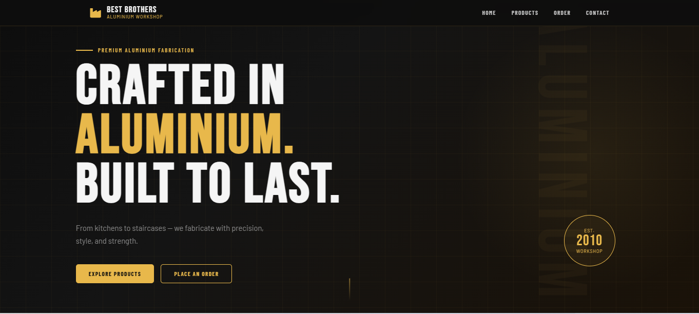

### 🛍️ All Products

  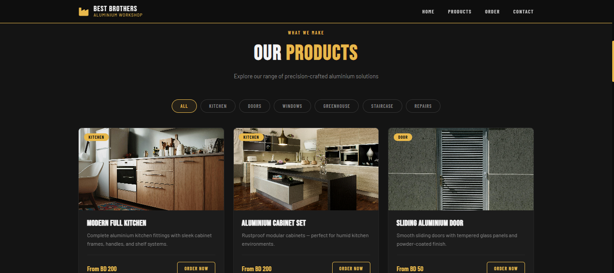

### 🚪 Doors

  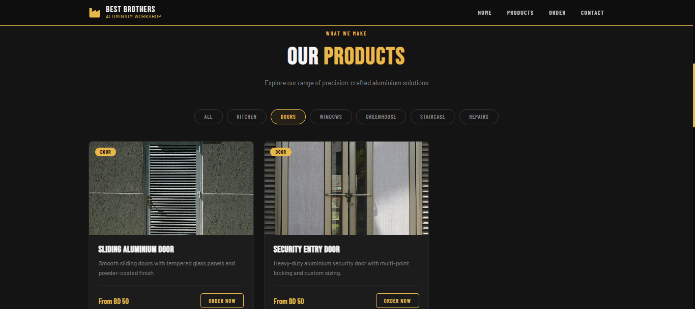

### 🪟 Windows

  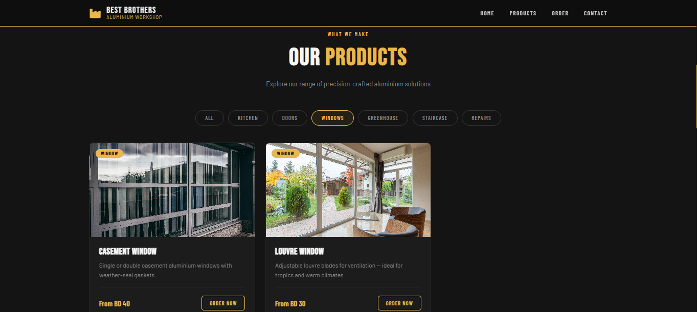

### 🍳 Kitchens

  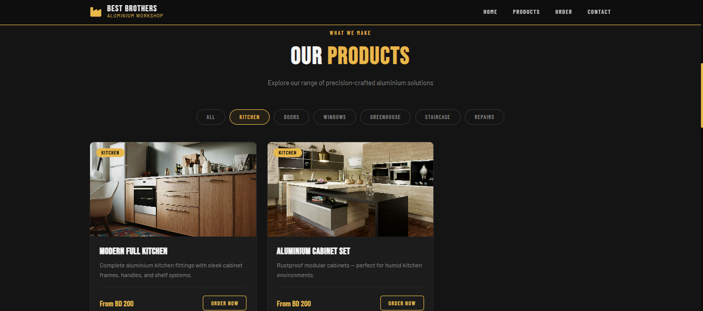

### 🌿 Greenhouse

  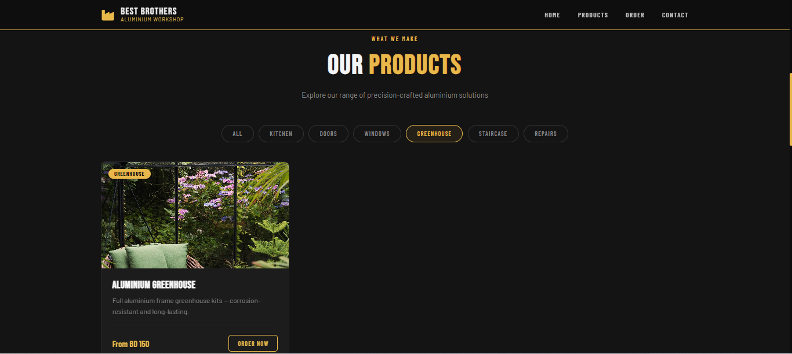

### 🪜 Staircases

  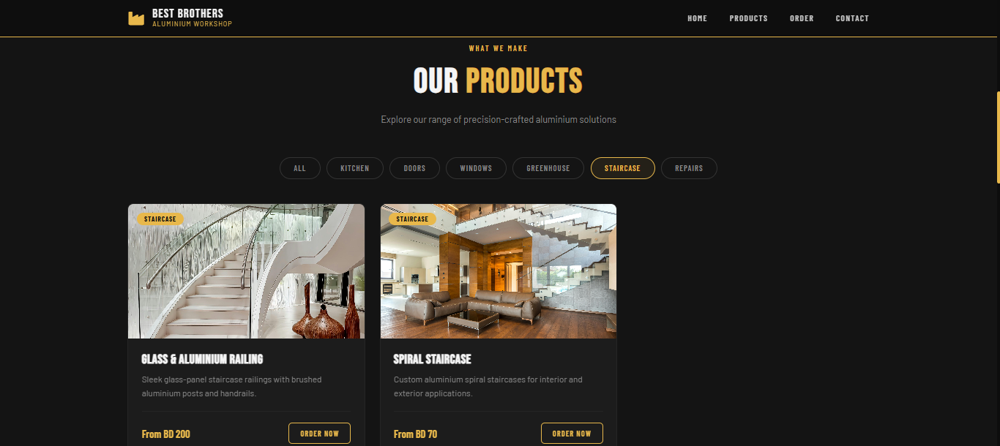

### 🔧 Services & Repairings

  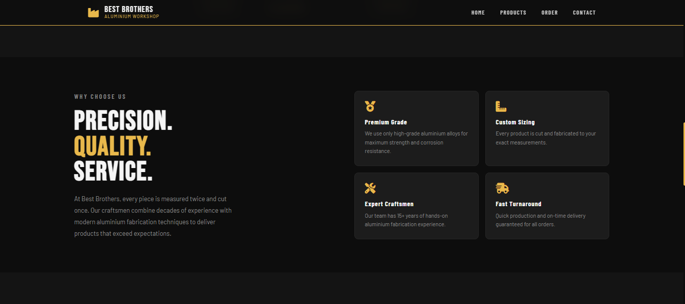
  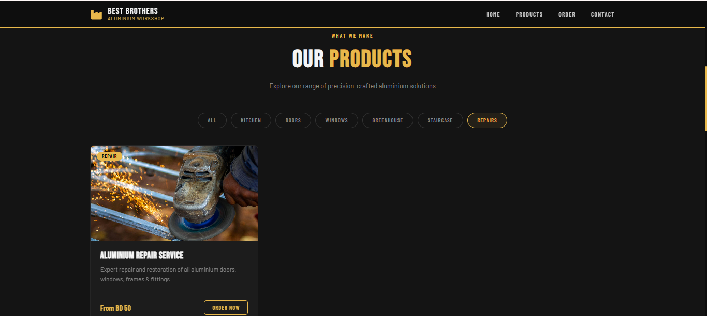

### 📋 Place Your Order

  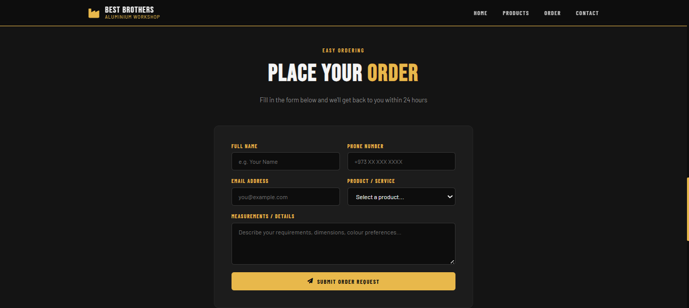

### 📍 Contact & Location

  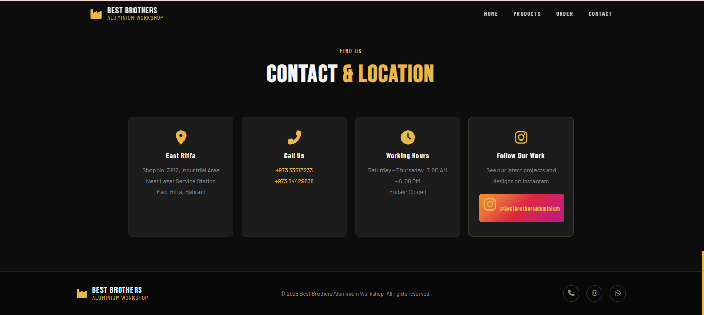

